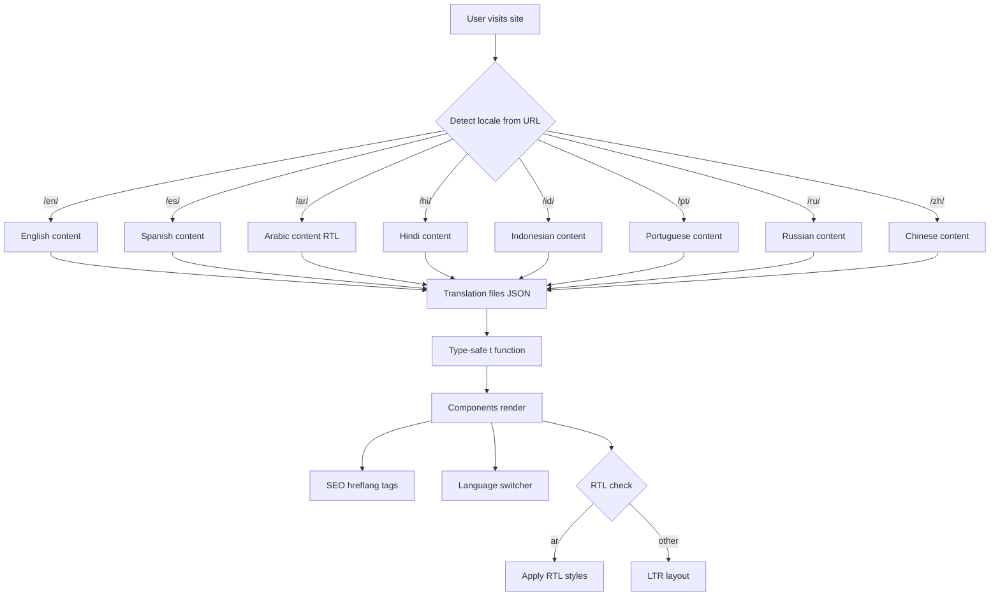

# Multi-Language i18n Implementation Plan

## Overview

Implement comprehensive internationalization (i18n) for 8 languages using `astro-i18n-aut`, which provides URL-based routing (`/en/`, `/es/`, `/ar/`, etc.) and avoids template duplication. The implementation includes a language switcher component, RTL (right-to-left) support for Arabic, SEO optimization with hreflang tags, TypeScript type safety, error handling, and performance optimizations.

## Supported Languages

- `en` (English) - Default locale
- `ar` (Arabic) - RTL support required
- `es` (Spanish)
- `hi` (Hindi)
- `id` (Indonesian)
- `pt` (Portuguese)
- `ru` (Russian)
- `zh` (Simplified Chinese)

## Architecture



## Implementation Steps

### 1. Install and Configure astro-i18n-aut

**Files to modify:**
- `package.json` - Add dependency
- `astro.config.mjs` - Configure i18n integration with proper settings

**Changes:**

```bash
npm install astro-i18n-aut
```

**Configuration in `astro.config.mjs`:**

```javascript
import { defineConfig } from 'astro/config';
import tailwindcss from '@tailwindcss/vite';
import { i18n } from 'astro-i18n-aut/integration';

const locales = {
  en: 'en-US',
  ar: 'ar-SA',
  es: 'es-ES',
  hi: 'hi-IN',
  id: 'id-ID',
  pt: 'pt-BR',
  ru: 'ru-RU',
  zh: 'zh-CN',
};

export default defineConfig({
  base: '/',
  output: 'static',
  site: 'https://binauralbeatstudio.com',
  trailingSlash: 'always',
  build: {
    format: 'directory',
  },
  integrations: [
    tailwindcss(),
    i18n({
      locales,
      defaultLocale: 'en',
      redirectDefaultLocale: false, // Keep /en/ in URL for consistency
    }),
  ],
  vite: {
    plugins: [tailwindcss()],
  },
});
```

**Key configuration decisions:**
- `trailingSlash: 'always'` - Required for directory-based routing
- `build.format: 'directory'` - Generates `/en/`, `/es/`, etc.
- `redirectDefaultLocale: false` - Keep `/en/` explicit for SEO consistency

### 2. Create Translation File Structure with Type Safety

**New files:**
- `src/i18n/en.json` - English translations (source of truth)
- `src/i18n/ar.json` - Arabic translations
- `src/i18n/es.json` - Spanish translations
- `src/i18n/hi.json` - Hindi translations
- `src/i18n/id.json` - Indonesian translations
- `src/i18n/pt.json` - Portuguese translations
- `src/i18n/ru.json` - Russian translations
- `src/i18n/zh.json` - Simplified Chinese translations
- `src/i18n/types.ts` - TypeScript type definitions for translation keys

**Translation keys structure:**

Organize translations by component/section for maintainability:

```json
{
  "meta": {
    "title": "MindState - Create Personalized Binaural Beats Sessions",
    "description": "The only binaural beats app that lets you design completely personalized audio sessions from scratch. Professional-grade tools for creating sessions that match your exact preferences."
  },
  "nav": {
    "features": "Features",
    "howItWorks": "How It Works",
    "screenshots": "Screenshots",
    "download": "Download"
  },
  "hero": {
    "title": "Create Personalized",
    "titleHighlight": "Binaural Beats",
    "titleSuffix": "Sessions",
    "subtitle": "The only binaural beats app that lets you design completely personalized audio sessions from scratch. Every frequency, volume, and timing decision is yours to control.",
    "ctaDownload": "Download on Play Store",
    "ctaLearnMore": "Learn More",
    "tagline": "Native Android app • Professional audio quality • Free to try"
  },
  "features": {
    "title": "Complete Control Over Your Audio Experience",
    "subtitle": "Unlike apps with fixed presets, MindState gives you professional-grade tools to create sessions that match your exact preferences, sensitivity, and goals.",
    "feature1": {
      "title": "Complete Personalization",
      "description": "Design sessions from scratch, not presets. Set carrier frequencies (80-600 Hz) and beat frequencies (0.5-40 Hz) to match your personal sensitivity."
    },
    "feature2": {
      "title": "Multi-Layered Sessions",
      "description": "Layer multiple track types: binaural beats, monaural beats, isochronic tones, noise generators, and your own audio files. Each track has independent volume control."
    },
    "feature3": {
      "title": "Point Editor",
      "description": "Create smooth volume transitions over time with point-level volume envelopes. Build sessions that start gentle and build intensity, or maintain steady frequencies."
    },
    "feature4": {
      "title": "Professional Editor",
      "description": "Granular control over every aspect: frequencies, volumes, timing, and transitions. Preview before saving to ensure your session is perfect."
    },
    "feature5": {
      "title": "QR Code Sharing",
      "description": "Generate QR codes to share your custom sessions instantly. Scan QR codes to discover sessions created by others, then modify them to match your preferences."
    },
    "feature6": {
      "title": "Professional Audio Quality",
      "description": "Native audio engine delivers crystal-clear sound with automatic sample rate conversion, phase-continuous synthesis, and low-latency processing."
    }
  },
  "howItWorks": {
    "title": "How It Works",
    "subtitle": "Create your perfect binaural beats session in just a few simple steps",
    "step1": {
      "title": "Create Custom Session",
      "description": "Start with a blank canvas or choose from bundled examples. Name your session and set the duration."
    },
    "step2": {
      "title": "Add Multiple Track Types",
      "description": "Layer binaural beats, monaural beats, isochronic tones, noise generators, or import your own audio files."
    },
    "step3": {
      "title": "Adjust Frequencies & Volumes",
      "description": "Set carrier frequencies (80-600 Hz) and beat frequencies (0.5-40 Hz) to match your sensitivity. Control track volumes and add volume envelopes."
    },
    "step4": {
      "title": "Preview & Save",
      "description": "Test your session with preview playback before saving. Make adjustments until it's perfect for you."
    },
    "step5": {
      "title": "Share via QR Code",
      "description": "Generate a QR code to share your session instantly. Scan codes from others to discover new sessions, then customize them to your preferences."
    }
  },
  "screenshots": {
    "title": "See It In Action",
    "subtitle": "Professional interface with Material Design 3, dark mode, and full localization",
    "sessionBrowser": "Session Browser",
    "sessionEditor": "Session Editor",
    "trackEditor": "Track Editor",
    "mainPlayer": "Main Player",
    "pointEditor": "Point Editor",
    "qrSharing": "QR Code Sharing"
  },
  "cta": {
    "title": "Start Creating Your Perfect Audio Experience",
    "subtitle": "Stop settling for presets that don't quite fit. MindState gives you the tools to create binaural beats sessions that are uniquely yours.",
    "ctaDownload": "Download on Play Store",
    "ctaViewFeatures": "View Features",
    "benefit1": {
      "title": "✓ Unlimited Sessions",
      "description": "Create unlimited custom sessions tailored to your preferences"
    },
    "benefit2": {
      "title": "✓ Professional Quality",
      "description": "Crystal-clear audio with phase-continuous synthesis"
    },
    "benefit3": {
      "title": "✓ Free to Try",
      "description": "Bundled sessions available to all users"
    }
  },
  "footer": {
    "description": "Create personalized binaural beats sessions tailored to your preferences.",
    "links": "Links",
    "download": "Download",
    "downloadDescription": "Available on the Google Play Store",
    "copyright": "© 2026 MindState. All rights reserved."
  },
  "languageSwitcher": {
    "label": "Language",
    "current": "Current language",
    "switchTo": "Switch to {language}"
  }
}
```

**TypeScript type definitions (`src/i18n/types.ts`):**

```typescript
export type TranslationKey = 
  | 'meta.title'
  | 'meta.description'
  | 'nav.features'
  | 'nav.howItWorks'
  | 'nav.screenshots'
  | 'nav.download'
  | 'hero.title'
  | 'hero.titleHighlight'
  | 'hero.titleSuffix'
  | 'hero.subtitle'
  | 'hero.ctaDownload'
  | 'hero.ctaLearnMore'
  | 'hero.tagline'
  // ... add all keys for type safety
  ;

export type Locale = 'en' | 'ar' | 'es' | 'hi' | 'id' | 'pt' | 'ru' | 'zh';

export interface Translations {
  [key: string]: string | Translations;
}
```

### 3. Create Translation Utility with Error Handling

**New file:**
- `src/utils/i18n.ts` - Translation utility with fallback handling

**Implementation:**

```typescript
import type { Locale } from '../i18n/types';
import enTranslations from '../i18n/en.json';

type TranslationKey = string;
type TranslationParams = Record<string, string | number>;

const translations: Record<Locale, any> = {
  en: () => import('../i18n/en.json'),
  ar: () => import('../i18n/ar.json'),
  es: () => import('../i18n/es.json'),
  hi: () => import('../i18n/hi.json'),
  id: () => import('../i18n/id.json'),
  pt: () => import('../i18n/pt.json'),
  ru: () => import('../i18n/ru.json'),
  zh: () => import('../i18n/zh.json'),
};

// Cache for loaded translations
const translationCache: Partial<Record<Locale, any>> = {};

export async function loadTranslations(locale: Locale): Promise<any> {
  if (translationCache[locale]) {
    return translationCache[locale];
  }
  
  try {
    const module = await translations[locale]();
    translationCache[locale] = module.default || module;
    return translationCache[locale];
  } catch (error) {
    console.warn(`Failed to load translations for ${locale}, falling back to English`);
    return enTranslations;
  }
}

export function getNestedValue(obj: any, path: string): string {
  return path.split('.').reduce((current, key) => current?.[key], obj) || path;
}

export function t(
  key: TranslationKey,
  locale: Locale,
  translations: any,
  params?: TranslationParams
): string {
  let translation = getNestedValue(translations, key);
  
  // Fallback to English if translation missing
  if (!translation || translation === key) {
    translation = getNestedValue(enTranslations, key) || key;
  }
  
  // Replace parameters in translation
  if (params && typeof translation === 'string') {
    return translation.replace(/\{(\w+)\}/g, (match, paramKey) => {
      return params[paramKey]?.toString() || match;
    });
  }
  
  return translation;
}
```

### 4. Update Components to Use Translations

**Files to modify:**
- `src/layouts/Layout.astro` - Use `getLocale()`, translation function, add hreflang tags, RTL support
- `src/components/Hero.astro` - Replace hardcoded text with `t()` calls
- `src/components/Features.astro` - Replace hardcoded text with `t()` calls
- `src/components/HowItWorks.astro` - Replace hardcoded text with `t()` calls
- `src/components/Screenshots.astro` - Replace hardcoded text with `t()` calls
- `src/components/CTA.astro` - Replace hardcoded text with `t()` calls
- `src/pages/index.astro` - Update to work with locale routing

**Pattern for components:**

```astro
---
import { getLocale } from 'astro-i18n-aut';
import { loadTranslations, t } from '../../utils/i18n';

const locale = getLocale(Astro.url);
const translations = await loadTranslations(locale);
const base = import.meta.env.BASE_URL;
---

<section>
  <h1>{t('hero.title', locale, translations)}</h1>
  <p>{t('hero.subtitle', locale, translations)}</p>
</section>
```

**Layout.astro updates:**

```astro
---
import '../styles/global.css';
import { getLocale } from 'astro-i18n-aut';
import { loadTranslations, t } from '../utils/i18n';

interface Props {
  title?: string;
  description?: string;
}

const locale = getLocale(Astro.url);
const translations = await loadTranslations(locale);
const base = import.meta.env.BASE_URL;

const title = Astro.props.title || t('meta.title', locale, translations);
const description = Astro.props.description || t('meta.description', locale, translations);

// Generate hreflang tags for all locales
const locales = ['en', 'ar', 'es', 'hi', 'id', 'pt', 'ru', 'zh'];
const currentPath = Astro.url.pathname.replace(`/${locale}/`, '/');
const isRTL = locale === 'ar';
---

<!doctype html>
<html lang={locale} dir={isRTL ? 'rtl' : 'ltr'}>
  <head>
    <meta charset="UTF-8" />
    <meta name="viewport" content="width=device-width, initial-scale=1.0" />
    <link rel="icon" type="image/svg+xml" href="/favicon.svg" />
    <meta name="generator" content={Astro.generator} />
    
    <!-- Primary Meta Tags -->
    <title>{title}</title>
    <meta name="title" content={title} />
    <meta name="description" content={description} />
    
    <!-- hreflang tags for SEO -->
    {locales.map((loc) => (
      <link
        rel="alternate"
        hreflang={loc}
        href={`https://binauralbeatstudio.com/${loc}${currentPath}`}
      />
    ))}
    <link rel="alternate" hreflang="x-default" href={`https://binauralbeatstudio.com/en${currentPath}`} />
    
    <!-- Open Graph / Facebook -->
    <meta property="og:type" content="website" />
    <meta property="og:title" content={title} />
    <meta property="og:description" content={description} />
    <meta property="og:locale" content={locale} />
    {locales.map((loc) => (
      <meta property="og:locale:alternate" content={loc} />
    ))}
    
    <!-- Twitter -->
    <meta property="twitter:card" content="summary_large_image" />
    <meta property="twitter:title" content={title} />
    <meta property="twitter:description" content={description} />
  </head>
  <body class={`antialiased bg-bhutan-primary text-bhutan-primary ${isRTL ? 'rtl' : 'ltr'}`}>
    <!-- Rest of layout -->
  </body>
</html>
```

### 5. Create Language Switcher Component

**New file:**
- `src/components/LanguageSwitcher.astro`

**Features:**
- Dropdown/select menu with all 8 languages
- Shows current language with flag/icon
- Updates URL to switch languages (e.g., `/en/` → `/es/`)
- Preserves current page/section when switching (handles hash fragments)
- Accessible with proper ARIA labels
- Keyboard navigation support
- Smooth transitions

**Implementation:**

```astro
---
import { getLocale } from 'astro-i18n-aut';

const locale = getLocale(Astro.url);
const base = import.meta.env.BASE_URL;

const languages = [
  { code: 'en', name: 'English', nativeName: 'English' },
  { code: 'ar', name: 'Arabic', nativeName: 'العربية' },
  { code: 'es', name: 'Spanish', nativeName: 'Español' },
  { code: 'hi', name: 'Hindi', nativeName: 'हिन्दी' },
  { code: 'id', name: 'Indonesian', nativeName: 'Bahasa Indonesia' },
  { code: 'pt', name: 'Portuguese', nativeName: 'Português' },
  { code: 'ru', name: 'Russian', nativeName: 'Русский' },
  { code: 'zh', name: 'Chinese', nativeName: '中文' },
];

function getCurrentPath(): string {
  // Extract path without locale prefix
  const path = Astro.url.pathname;
  const localeMatch = path.match(/^\/(en|ar|es|hi|id|pt|ru|zh)\//);
  if (localeMatch) {
    return path.replace(`/${localeMatch[1]}/`, '/');
  }
  return '/';
}

const currentPath = getCurrentPath();
const currentLang = languages.find(l => l.code === locale) || languages[0];
---

<div class="language-switcher relative">
  <label for="language-select" class="sr-only">Select language</label>
  <select
    id="language-select"
    class="appearance-none bg-bhutan-secondary border border-bhutan-light rounded-lg px-4 py-2 pr-8 text-bhutan-primary cursor-pointer hover:bg-bhutan-primary transition-colors"
    aria-label="Select language"
    onchange={`window.location.href = '${base}' + this.value + '${currentPath}' + window.location.hash`}
  >
    {languages.map((lang) => (
      <option value={lang.code} selected={lang.code === locale}>
        {lang.nativeName}
      </option>
    ))}
  </select>
  <div class="pointer-events-none absolute inset-y-0 right-0 flex items-center px-2 text-bhutan-secondary">
    <svg class="w-4 h-4" fill="none" stroke="currentColor" viewBox="0 0 24 24">
      <path stroke-linecap="round" stroke-linejoin="round" stroke-width="2" d="M19 9l-7 7-7-7" />
    </svg>
  </div>
</div>

<style>
  .language-switcher select {
    background-image: none;
  }
  
  /* RTL adjustments */
  :global([dir="rtl"]) .language-switcher select {
    padding-left: 2rem;
    padding-right: 1rem;
  }
  
  :global([dir="rtl"]) .language-switcher .pointer-events-none {
    left: 0;
    right: auto;
  }
</style>
```

### 6. Add RTL Support for Arabic

**Files to modify:**
- `src/layouts/Layout.astro` - Add `dir="rtl"` attribute and RTL class
- `src/styles/global.css` - Add comprehensive RTL-specific styles

**RTL CSS additions:**

```css
/* RTL Support */
[dir="rtl"] {
  direction: rtl;
}

[dir="rtl"] .flex {
  flex-direction: row-reverse;
}

[dir="rtl"] .text-left {
  text-align: right;
}

[dir="rtl"] .text-right {
  text-align: left;
}

[dir="rtl"] .ml-auto {
  margin-left: 0;
  margin-right: auto;
}

[dir="rtl"] .mr-auto {
  margin-right: 0;
  margin-left: auto;
}

[dir="rtl"] .pl-4 {
  padding-left: 0;
  padding-right: 1rem;
}

[dir="rtl"] .pr-4 {
  padding-right: 0;
  padding-left: 1rem;
}

/* RTL-specific adjustments for timeline in HowItWorks */
[dir="rtl"] .timeline-line {
  right: 50%;
  left: auto;
  transform: translateX(50%);
}

/* RTL navigation adjustments */
[dir="rtl"] nav .flex {
  flex-direction: row-reverse;
}

/* RTL grid adjustments */
[dir="rtl"] .grid {
  direction: rtl;
}
```

### 7. Update Navigation and Links

**Files to modify:**
- `src/layouts/Layout.astro` - Update navigation links to include locale prefix
- All components with internal links - Use locale-aware link generation

**Helper function for locale-aware links:**

```typescript
// src/utils/links.ts
import type { Locale } from '../i18n/types';

export function getLocalizedLink(path: string, locale: Locale, base: string = ''): string {
  // Remove leading slash if present
  const cleanPath = path.startsWith('/') ? path.slice(1) : path;
  // Ensure locale prefix
  return `${base}/${locale}/${cleanPath}`;
}

export function getLocalizedHashLink(hash: string, locale: Locale, base: string = ''): string {
  return `${base}/${locale}/${hash}`;
}
```

**Usage in components:**

```astro
---
import { getLocale } from 'astro-i18n-aut';
import { getLocalizedHashLink } from '../../utils/links';

const locale = getLocale(Astro.url);
const base = import.meta.env.BASE_URL;
---

<a href={getLocalizedHashLink('#features', locale, base)}>Features</a>
```

### 8. Generate Initial Translations

**Process:**
1. Extract all English text from components into `src/i18n/en.json`
2. Use AI to generate translations for all 7 other languages
3. Create a translation glossary for technical terms:
   - "binaural beats" → Keep consistent across languages or provide native equivalent
   - "carrier frequencies" → Technical term translation
   - "isochronic tones" → Technical term translation
   - "volume envelopes" → Technical term translation
4. Review and refine translations, especially:
   - Technical audio terminology
   - UI/UX terms
   - Marketing copy tone
   - Cultural appropriateness

**Translation quality checklist:**
- [ ] Technical terms are accurate and consistent
- [ ] Marketing tone matches brand voice in each language
- [ ] Cultural references are appropriate
- [ ] No offensive or inappropriate translations
- [ ] Length considerations (some languages are longer/shorter)
- [ ] Proper grammar and spelling
- [ ] Native speaker review (recommended for production)

### 9. SEO Optimization

**Files to modify:**
- `src/layouts/Layout.astro` - Add hreflang tags (already covered in step 4)
- Create `public/robots.txt` - Ensure all locales are crawlable
- Create `public/sitemap.xml` or use `@astrojs/sitemap` integration

**Sitemap configuration:**

```javascript
// astro.config.mjs addition
import sitemap from '@astrojs/sitemap';

export default defineConfig({
  // ... existing config
  integrations: [
    // ... existing integrations
    sitemap({
      i18n: {
        defaultLocale: 'en',
        locales: {
          en: 'en-US',
          ar: 'ar-SA',
          es: 'es-ES',
          hi: 'hi-IN',
          id: 'id-ID',
          pt: 'pt-BR',
          ru: 'ru-RU',
          zh: 'zh-CN',
        },
      },
    }),
  ],
});
```

**robots.txt:**

```
User-agent: *
Allow: /

Sitemap: https://binauralbeatstudio.com/sitemap-index.xml
Sitemap: https://binauralbeatstudio.com/sitemap-0.xml
```

### 10. Update Build Configuration

**Files to modify:**
- `astro.config.mjs` - Ensure directory format and trailing slashes work with i18n
- `.github/workflows/deploy.yml` - Verify build process works with locale routing

**Build verification:**
- Ensure all 8 locale routes are generated
- Check that assets load correctly for all locales
- Verify base path handling works with custom domain

### 11. Error Handling and Fallbacks

**Implementation:**
- Translation loading errors fall back to English
- Missing translation keys fall back to English
- Invalid locale redirects to default locale
- 404 pages should be localized

**New file:**
- `src/pages/404.astro` - Localized 404 page

```astro
---
import Layout from '../layouts/Layout.astro';
import { getLocale } from 'astro-i18n-aut';
import { loadTranslations, t } from '../utils/i18n';

const locale = getLocale(Astro.url);
const translations = await loadTranslations(locale);
---

<Layout>
  <section class="py-20 text-center">
    <h1 class="text-4xl font-bold mb-4">404</h1>
    <p>{t('errors.notFound', locale, translations) || 'Page not found'}</p>
  </section>
</Layout>
```

### 12. Performance Optimizations

**Considerations:**
- Lazy load translation files (already implemented with dynamic imports)
- Cache translations in memory
- Minimize translation file size
- Use CDN for static assets
- Optimize images for all locales

**Translation file optimization:**
- Keep JSON files minified in production
- Consider splitting large translation files by route (if needed in future)

## File Structure After Implementation

```
src/
├── i18n/
│   ├── en.json
│   ├── ar.json
│   ├── es.json
│   ├── hi.json
│   ├── id.json
│   ├── pt.json
│   ├── ru.json
│   ├── zh.json
│   └── types.ts
├── utils/
│   ├── i18n.ts (new)
│   └── links.ts (new)
├── components/
│   ├── Hero.astro (updated)
│   ├── Features.astro (updated)
│   ├── HowItWorks.astro (updated)
│   ├── Screenshots.astro (updated)
│   ├── CTA.astro (updated)
│   └── LanguageSwitcher.astro (new)
├── layouts/
│   └── Layout.astro (updated)
└── pages/
    ├── index.astro (updated)
    └── 404.astro (new)
```

## Difficulty Assessment

**Complexity: Medium-High**

**Effort breakdown:**
- Setup and configuration: ~45 minutes
- Creating translation structure: ~1.5 hours
- Creating utility functions: ~1 hour
- Updating all components: ~3-4 hours
- Generating translations: ~2-3 hours (AI-assisted)
- Language switcher component: ~1.5 hours
- RTL support: ~1 hour
- SEO optimization: ~1 hour
- Error handling: ~30 minutes
- Testing all languages: ~2-3 hours
- Performance optimization: ~1 hour

**Total estimated time: 14-18 hours**

## Challenges

1. **Text extraction**: Identifying all hardcoded strings across components
   - **Solution**: Systematic component-by-component review, use grep to find strings

2. **Translation quality**: Technical terms need careful translation
   - **Solution**: Create glossary, use AI with context, native speaker review

3. **RTL layout**: Arabic may need layout adjustments beyond `dir="rtl"`
   - **Solution**: Comprehensive RTL CSS, test thoroughly, adjust flex/grid layouts

4. **URL structure**: Ensuring all internal links work with locale prefixes
   - **Solution**: Centralized link utility functions, test all navigation paths

5. **SEO**: Meta tags need to be localized, hreflang tags required
   - **Solution**: Automated hreflang generation, localized meta tags

6. **Performance**: Loading 8 translation files
   - **Solution**: Lazy loading, caching, code splitting

7. **Type safety**: Ensuring translation keys are valid
   - **Solution**: TypeScript types, validation functions

## Benefits

- `astro-i18n-aut` handles routing automatically
- No template duplication needed
- Type-safe translations with TypeScript
- Clean URL structure (`/en/`, `/es/`, etc.)
- SEO-friendly with hreflang tags
- Accessible language switcher
- Proper RTL support for Arabic
- Fallback handling for missing translations
- Performance optimized with lazy loading

## Testing Checklist

### Functional Testing
- [ ] All 8 languages render correctly
- [ ] Language switcher works on all pages
- [ ] RTL layout works for Arabic (test all components)
- [ ] Internal links preserve locale
- [ ] External links (Play Store) work correctly
- [ ] Hash fragments (#section) work with locale switching
- [ ] 404 page is localized
- [ ] Error handling works (missing translations fall back to English)

### SEO Testing
- [ ] Meta tags are localized for each language
- [ ] hreflang tags are present and correct
- [ ] Sitemap includes all locales
- [ ] robots.txt allows crawling
- [ ] Each locale has unique, localized content

### Visual Testing
- [ ] Images and assets load correctly for all locales
- [ ] RTL layout doesn't break any components
- [ ] Language switcher is accessible and styled correctly
- [ ] Mobile menu works with translations
- [ ] Responsive design works for all languages

### Performance Testing
- [ ] Translation files load efficiently
- [ ] No performance degradation with multiple locales
- [ ] Build time is acceptable
- [ ] Bundle size is optimized

### Accessibility Testing
- [ ] Language switcher is keyboard navigable
- [ ] Screen readers announce language changes
- [ ] ARIA labels are present and correct
- [ ] Focus management works correctly
- [ ] RTL content is properly announced

### Cross-browser Testing
- [ ] Chrome/Edge (Chromium)
- [ ] Firefox
- [ ] Safari
- [ ] Mobile browsers (iOS Safari, Chrome Mobile)

## Maintenance Considerations

### Adding New Languages
1. Add locale to `astro.config.mjs`
2. Create new translation file `src/i18n/[locale].json`
3. Add to language switcher component
4. Update TypeScript types if using strict typing
5. Test thoroughly

### Updating Translations
1. Update English source file first
2. Update other language files
3. Use translation management tool (optional, for larger projects)
4. Test changes across all locales

### Monitoring
- Track which languages are most used
- Monitor for missing translations (log warnings)
- Track SEO performance per locale
- Monitor page load times per locale

## Future Enhancements

1. **Translation Management System**: Integrate with services like Crowdin, Lokalise, or Transifex
2. **Auto-detection**: Detect user's browser language and redirect
3. **Language-specific content**: Different images or content per locale
4. **Pluralization**: Proper plural forms for different languages
5. **Date/Number formatting**: Locale-specific formatting
6. **Analytics**: Track language usage and conversion rates per locale

## Deployment Checklist

- [ ] All translation files are committed
- [ ] Build succeeds for all locales
- [ ] All routes generate correctly (`/en/`, `/es/`, etc.)
- [ ] Assets load correctly on production
- [ ] hreflang tags are verified
- [ ] Sitemap is generated correctly
- [ ] 404 handling works
- [ ] Language switcher works in production
- [ ] RTL layout tested in production
- [ ] Performance metrics are acceptable
- [ ] SEO tools (Google Search Console) configured for all locales

